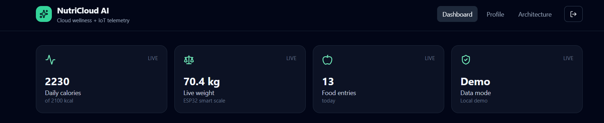
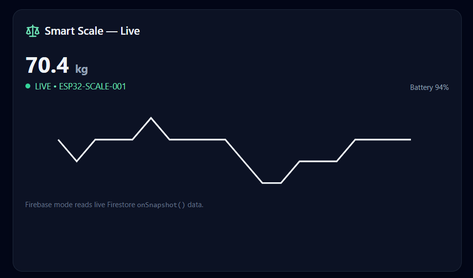
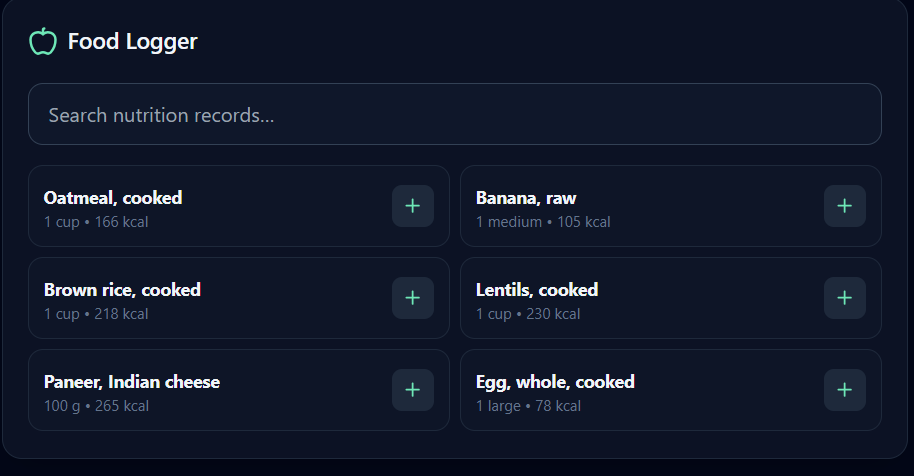
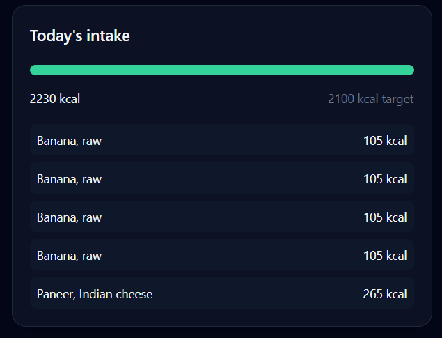
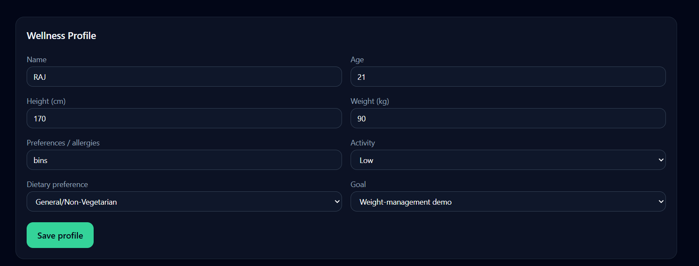
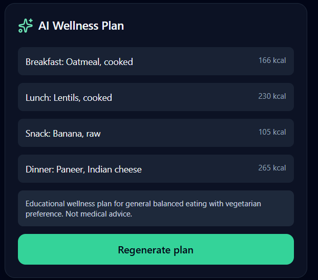

# 🥗 NutriCloud AI — AI-Powered Personal Diet Planner

<p align="center">


<br/>


</p>

<p align="center">

**A full-stack AI + IoT wellness platform for personalized diet planning, nutrition tracking, and smart-scale telemetry.**

</p>

---

## 🚀 Project Overview

**NutriCloud AI** is an industry-oriented full-stack application designed to explore how **Artificial Intelligence, Cloud Computing, IoT, real-time data, and modern web development** can work together in a single system.

The platform allows users to:

- 👤 Create and manage a wellness profile
- 🍱 Log food and track daily intake
- 🤖 Generate personalized wellness-oriented meal suggestions
- ⚖️ Receive simulated smart-scale telemetry
- 📊 Monitor weight and nutrition trends
- 💾 Persist user data
- ☁️ Use a Firebase-ready cloud architecture
- 🔄 Process real-time scale data
- 🧪 Run automated tests and CI checks
- 💻 Run locally without requiring paid cloud resources

The current public portfolio version uses **Demo Mode by default** to keep the project inexpensive and reproducible.

The architecture remains structured for future Firebase/cloud integration.

---

## 🎯 Problem Statement

People often struggle with:

- planning meals consistently
- tracking food intake
- understanding nutrition patterns
- monitoring weight changes
- maintaining useful historical data

NutriCloud AI explores a unified architecture where:

```text
User Profile
     ↓
Nutrition Data
     ↓
AI Wellness Planner
     ↓
Daily Food Tracking
     ↓
Smart Scale Telemetry
     ↓
Progress Dashboard
```

The project focuses on **software engineering, AI application architecture, cloud concepts, and IoT integration** rather than providing medical or clinical advice.

---

# ✨ Key Features

## 🤖 AI Wellness Planning

The application generates personalized wellness-oriented suggestions using information such as:

- Dietary preference
- User goal
- Activity level
- Weight
- Height
- Age
- Nutrition information

The AI layer also supports a **local fallback mechanism**, allowing the application to remain usable when an external AI service is unavailable.

---

## 🍎 Food Logging

Users can search and log foods from the application's nutrition dataset.

The dashboard tracks:

- Daily calories
- Food entries
- Nutrition information
- Meal history

The project also includes a workflow for importing nutrition information from **USDA FoodData Central**.

---

## ⚖️ IoT Smart Scale

The project includes a simulated ESP32 smart-scale workflow.

Telemetry contains:

```json
{
  "weightKg": 70.5,
  "batteryPct": 94,
  "deviceId": "ESP32-SCALE-001",
  "timestamp": "2026-09-30T12:00:00Z"
}
```

The Wokwi hardware simulation uses:

- ESP32
- HX711
- Load-cell concept
- OLED display
- Status LED

---

# 📡 IoT → Cloud Architecture

```text
┌─────────────────────┐
│    ESP32 / Wokwi    │
│     Smart Scale     │
└──────────┬──────────┘
           │
           │ HTTPS Telemetry
           ↓
┌────────────────────────────┐
│ Firebase Cloud Function    │
│ ingestScaleTelemetry       │
└────────────┬───────────────┘
             │
             ↓
┌────────────────────────────┐
│       Cloud Firestore      │
│       Scale Readings       │
└────────────┬───────────────┘
             │
             │ Real-time Listener
             ↓
┌────────────────────────────┐
│      React Dashboard       │
│      Weight Monitoring     │
└────────────────────────────┘
```

The architecture is designed around real-time Firestore listeners for cloud-connected scale readings.

---

# ☁️ Cloud Architecture

```text
                         ┌───────────────────┐
                         │       User        │
                         └─────────┬─────────┘
                                   │
                                   ↓
                         ┌───────────────────┐
                         │ React + Vite      │
                         │ TypeScript        │
                         │ Tailwind CSS      │
                         └─────────┬─────────┘
                                   │
              ┌────────────────────┼─────────────────────┐
              ↓                    ↓                     ↓
       Authentication          Firestore             Storage
              │                    │                     │
              │             ┌──────┴──────┐              │
              │             │             │              │
              │         Food Logs      Scale Data         │
              │                            ↑              │
              │                            │              │
              │                     ESP32 / Wokwi          │
              │                                           │
              └──────────────────┬────────────────────────┘
                                 ↓
                       ┌────────────────────┐
                       │  Cloud Functions   │
                       │  AI / Telemetry    │
                       └──────────┬─────────┘
                                  │
                                  ↓
                        Nutrition / AI APIs
```

---

# 🧠 AI Architecture

```text
User Profile
     ↓
Validation
     ↓
Recommendation Engine
     │
     ├── External AI Available
     │          ↓
     │    AI-generated plan
     │
     └── External AI Unavailable
                ↓
        Rule-based fallback
                ↓
          Wellness plan
```

This architecture reduces dependency on a single external AI service.

---

# 🛠️ Technology Stack

| Layer | Technology |
|---|---|
| Frontend | React |
| Language | TypeScript |
| Build Tool | Vite |
| UI | Tailwind CSS |
| Charts | Recharts |
| Authentication | Firebase Authentication architecture |
| Database | Cloud Firestore architecture |
| Storage | Firebase Storage architecture |
| Backend | Firebase Cloud Functions |
| AI | AI Recommendation Engine + Fallback |
| IoT | ESP32 |
| Hardware Simulation | Wokwi |
| Nutrition Data | USDA FoodData Central |
| Testing | Vitest |
| CI/CD | GitHub Actions |
| Version Control | Git + GitHub |

---

# 📁 Project Structure

```text
AI-Personal-Diet-Planner-Industry/
│
├── .github/
│   └── workflows/
│       └── ci.yml
│
├── docs/
│   ├── ARCHITECTURE.md
│   ├── DATA_SOURCES.md
│   ├── INSTALLATION.md
│   ├── INTERVIEW.md
│   └── RECRUITER_DEMO.md
│
├── functions/
│   ├── src/
│   │   └── index.ts
│   ├── package.json
│   └── tsconfig.json
│
├── scripts/
│   └── seed-usda-foods.mjs
│
├── screenshots/
│   ├── dashboard.png
│   ├── food_logger.png
│   ├── smart_scale.png
│   ├── today_intake.png
│   ├── wellness_profile.png
│   └── ai_wellness_plans.png
│
├── src/
│   ├── components/
│   │   └── App.tsx
│   ├── data/
│   │   └── foods.ts
│   ├── services/
│   │   ├── ai.ts
│   │   ├── auth.ts
│   │   ├── firebase.ts
│   │   └── store.ts
│   ├── main.tsx
│   ├── styles.css
│   └── vite-env.d.ts
│
├── tests/
│   └── ai.test.ts
│
├── wokwi/
│   └── smart-scale/
│       ├── diagram.json
│       ├── libraries.txt
│       ├── platformio.ini
│       ├── sketch.ino
│       └── wokwi.toml
│
├── firestore.rules
├── storage.rules
├── firebase.json
├── .env.example
├── package.json
├── tsconfig.json
├── vite.config.ts
└── README.md
```

---

# 🚀 Installation

## 1. Clone Repository

```bash
git clone https://github.com/sujalkrshaw/AI-Personal-Diet-Planner-Industry.git
cd AI-Personal-Diet-Planner-Industry
```

---

## 2. Install Frontend Dependencies

```bash
npm install
```

---

## 3. Install Firebase Function Dependencies

```bash
npm install --prefix functions
```

---

# 🔐 Environment Configuration

Create your local environment file:

### Windows PowerShell

```powershell
Copy-Item .env.example .env
```

For the portfolio/demo version:

```env
VITE_DEMO_MODE=true
```

The `.env` file is intentionally excluded from Git.

### Never commit:

```text
.env
service-account.json
Firebase Admin credentials
private API keys
secret tokens
```

---

# ▶️ Run the Application

Start the development server:

```bash
npm run dev
```

Open:

```text
http://localhost:5173
```

---

# 🎮 Demo Mode

The public portfolio version runs with:

```env
VITE_DEMO_MODE=true
```

Demo Mode provides:

- ⚡ Local execution
- 💾 Local application state
- ⚖️ Simulated smart-scale telemetry
- 📊 Dashboard updates
- 🤖 AI fallback functionality
- 🧪 Local testing
- 💰 No requirement for paid cloud resources

This makes the repository easy for recruiters and developers to clone and run.

---

# ⚖️ Smart Scale Demo

The local telemetry simulator generates readings from:

```text
ESP32-SCALE-001
```

Example:

```text
Device: ESP32-SCALE-001
Weight: 70.5 kg
Battery: 94%
Status: Online
```

The simulator updates the dashboard periodically to demonstrate a connected IoT workflow.

---

# 🔬 Wokwi Smart Scale

Hardware architecture:

```text
             ESP32
               │
       ┌───────┼────────┐
       │       │        │
      HX711   OLED     LED
       │
   Load Cell
```

### Wiring

| Component | ESP32 |
|---|---|
| HX711 VCC | 5V |
| HX711 GND | GND |
| HX711 DT | GPIO16 |
| HX711 SCK | GPIO4 |
| OLED VCC | 3.3V |
| OLED GND | GND |
| OLED SDA | GPIO21 |
| OLED SCL | GPIO22 |
| Status LED | GPIO2 |

Firmware:

```text
wokwi/smart-scale/sketch.ino
```

---

# 🧪 Testing

Run automated tests:

```bash
npm test
```

Current verified result:

```text
✓ tests/ai.test.ts
1 test passed
```

---

# 🔍 Type Checking

Run:

```bash
npm run check
```

The verified project currently passes TypeScript validation without errors.

---

# 📦 Production Build

Run:

```bash
npm run build
```

The application generates:

```text
dist/
```

A Vite chunk-size warning may appear because the current JavaScript bundle is relatively large. This does not prevent the build from succeeding.

Future optimization:

- Code splitting
- Lazy loading
- Dependency optimization
- Chart bundle optimization

---

# 🔄 CI/CD

GitHub Actions configuration:

```text
.github/workflows/ci.yml
```

Workflow:

```text
Git Push
   ↓
GitHub Actions
   ↓
Install Dependencies
   ↓
Type Check
   ↓
Run Tests
   ↓
Build Application
   ↓
PASS / FAIL
```

---

# 🔐 Security

The project follows several basic security principles.

### Authentication

Firebase Authentication is part of the cloud architecture.

### Authorization

User data is designed around user-specific paths:

```text
users/{uid}/...
```

### Environment Variables

Configuration is loaded through environment variables.

### Secret Protection

Private credentials must never be stored inside:

```text
React source code
ESP32 firmware
GitHub repository
```

### IoT Security

The intended cloud telemetry architecture uses a device ingest secret rather than Firebase Admin credentials inside ESP32 firmware.

**Firebase Admin service-account credentials must never be embedded in IoT firmware.**

---

# 🗄️ Data Model

Cloud-ready Firestore structure:

```text
users/
   {userId}/
       profile

       food_logs/
           {foodLogId}

       scale_readings/
           {readingId}

       diet_plans/
           {planId}
```

This separates:

- User profile
- Food history
- IoT telemetry
- Generated wellness plans

---

# 📊 Dashboard

The dashboard combines:

```text
Daily Calories
      +
Food Entries
      +
Smart Scale
      +
Weight Trend
      +
AI Wellness Plan
      +
Recent Food Logs
```

---

# 🖼️ Screenshots

## Dashboard



## Smart Scale



## Food Logger



## Today's Intake



## Wellness Profile



## AI Wellness Plans



---

# 🌐 Nutrition Data

The project includes a workflow for importing nutrition information from:

**USDA FoodData Central**

Import script:

```text
scripts/seed-usda-foods.mjs
```

API credentials should be provided through environment variables.

Never commit API keys to GitHub.

---

# ☁️ Cloud Computing Concepts

| Concept | Demonstrated Through |
|---|---|
| Cloud Computing | Firebase-ready architecture |
| SaaS | Browser-based application |
| Authentication | Firebase Authentication |
| Cloud Database | Firestore |
| Object Storage | Firebase Storage |
| Serverless Computing | Cloud Functions |
| HTTP APIs | Telemetry/backend communication |
| Real-time Data | Firestore listeners |
| IoT | ESP32 smart scale |
| API Integration | Nutrition/AI services |
| Security Rules | Firestore + Storage rules |
| Environment Variables | `.env` configuration |
| CI/CD | GitHub Actions |
| Scalability | Serverless architecture |

---

# 🧩 Engineering Challenges

## TypeScript Configuration

Resolved TypeScript and Vite configuration compatibility issues during development.

## Firebase Integration

Separated Firebase configuration from application logic.

## Demo/Cloud Separation

Designed the application so local development does not require active cloud resources.

## IoT Telemetry

Created a reusable telemetry structure for simulated hardware and dashboard integration.

## AI Reliability

Implemented a fallback recommendation path for situations where an external AI service is unavailable.

## Automated Verification

Added:

```text
Type Checking
+
Unit Testing
+
Production Build
```

---

# 🧪 Verification Checklist

Before pushing future changes:

```text
[✓] npm run check
[✓] npm test
[✓] npm run build
[✓] Demo Mode works
[✓] Smart-scale simulation works
[✓] Screenshots updated
[✓] No .env committed
[✓] No service-account credentials committed
[✓] GitHub Actions configuration present
```

---

# 💰 Cost-Conscious Development

The current public version follows a local-first strategy:

```text
Local Development
       ↓
Demo Mode
       ↓
Automated Testing
       ↓
GitHub Portfolio
       ↓
Optional Cloud Deployment
```

Cloud deployment is **not required** to run the public demo.

This keeps development cost low while maintaining a cloud-ready architecture.

---

# 🛣️ Development Roadmap

## ✅ Phase 1 — Core Application

- [x] React frontend
- [x] TypeScript
- [x] Tailwind CSS
- [x] Dashboard
- [x] Food logging
- [x] Wellness profile
- [x] AI recommendation logic
- [x] Local Demo Mode

## ✅ Phase 2 — IoT

- [x] ESP32 architecture
- [x] Wokwi smart-scale simulation
- [x] Telemetry model
- [x] Local smart-scale simulation
- [x] Weight visualization

## ✅ Phase 3 — Engineering Quality

- [x] Type checking
- [x] Automated tests
- [x] Production build
- [x] Git repository
- [x] GitHub Actions configuration
- [x] Documentation
- [x] Architecture documentation

## 🔄 Phase 4 — Future Improvements

- [ ] Expand automated test coverage
- [ ] Optimize bundle size
- [ ] Expand nutrition dataset
- [ ] Improve AI recommendation strategies
- [ ] Improve IoT device authentication
- [ ] Connect physical ESP32 hardware
- [ ] Advanced analytics
- [ ] Cloud deployment when required
- [ ] Monitoring and observability
- [ ] Performance optimization

---

# 📈 Future Architecture

```text
                 Web / Mobile Client
                         │
                         ↓
                API / Cloud Functions
                         │
          ┌──────────────┼──────────────┐
          ↓              ↓              ↓
      Firestore       AI Service      Storage
          ↑
          │
      IoT Devices
          ↑
          │
      ESP32 Scale
```

Possible future improvements:

- Multiple IoT devices
- Event-driven processing
- Analytics pipelines
- Caching
- Monitoring
- Rate limiting
- Background jobs
- Serverless scaling
- Mobile application

---

# 🎓 Learning Outcomes

This project provides hands-on experience with:

- Full-stack development
- React + TypeScript
- Cloud architecture
- Firebase
- Firestore data modeling
- IoT telemetry
- ESP32 development
- Wokwi simulation
- AI application architecture
- API integration
- Authentication
- Authorization
- Environment configuration
- Automated testing
- CI/CD
- Git/GitHub
- Technical documentation
- Cloud security fundamentals

---

# 💼 Recruiter Demo Flow

A short technical demonstration can follow this sequence:

### 1️⃣ Dashboard

Show the overall application.

### 2️⃣ Wellness Profile

Demonstrate user-specific information.

### 3️⃣ Food Logger

Add a food item and show the intake update.

### 4️⃣ Smart Scale

Show simulated ESP32 telemetry.

### 5️⃣ Weight Monitoring

Demonstrate changing telemetry data.

### 6️⃣ AI Wellness Plan

Generate a personalized wellness-oriented plan.

### 7️⃣ Architecture

Explain:

```text
React
 ↓
Application Services
 ↓
Demo Store / Firebase
 ↓
Cloud Functions
 ↓
IoT Telemetry
```

### 8️⃣ Engineering Verification

Run:

```bash
npm test
npm run check
npm run build
```

This demonstrates that the project includes testing and build verification rather than only a visual interface.

---

# 🎤 Interview Talking Points

### Why Firebase?

Firebase provides managed services such as authentication, database, storage and serverless capabilities.

### Why Firestore?

The application's data is document-oriented and benefits from user-scoped collections and real-time updates.

### Why ESP32?

ESP32 provides an accessible platform for demonstrating connected IoT telemetry.

### Why Wokwi?

Wokwi allows the hardware workflow to be demonstrated without requiring physical hardware.

### Why Demo Mode?

Demo Mode makes the repository reproducible without requiring every developer or recruiter to configure cloud resources.

### How could the system scale?

Potential improvements include:

- Serverless functions
- Managed databases
- Caching
- CDN
- Asynchronous queues
- Monitoring
- Rate limiting
- Optimized database queries

---

# ⚠️ Disclaimer

NutriCloud AI is an **educational software engineering project**.

Generated diet and wellness suggestions are **general educational examples** and are not medical, clinical, or professional nutritional advice.

Users should consult an appropriately qualified healthcare or nutrition professional for individualized guidance.

---

# 👨‍💻 Author

## Sujal Kumar Shaw

Electronics & Communication Engineering Student

### Areas of Interest

```text
AI
Cloud Computing
IoT
Embedded Systems
Machine Learning
Full-Stack Development
```

---

# ⭐ Project Philosophy

NutriCloud AI is designed as more than a basic CRUD application.

It combines multiple engineering domains:

```text
                 AI
                 │
                 ↓
Frontend ←──── Cloud ────→ Database
   │              │
   ↓              ↓
  IoT ←──────── ESP32
   │
   ↓
Real-time Data
```

The development lifecycle is:

```text
Problem
   ↓
Architecture
   ↓
Implementation
   ↓
Integration
   ↓
Testing
   ↓
Documentation
   ↓
GitHub
   ↓
Continuous Improvement
```

---

# 📌 Project Status

🟢 **Active Development**

The project will continue evolving through incremental improvements in:

- AI capabilities
- IoT integration
- Cloud connectivity
- Testing
- Security
- Performance
- Documentation
- Scalability

> **Built as a practical exploration of AI + Cloud + IoT engineering — not just a UI project.**

---
